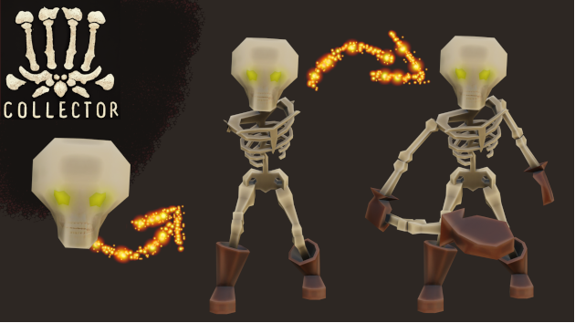

# Bones Collector

Help Skelly to find bones, combine them to build his body back! 
Game made for the [bevy Jam#2](https://itch.io/jam/bevy-jam-2).

Play it here in your browser: [itch.io](https://drusyc123.itch.io/bone-collector)!

## Retrospective 

This is my first game ever made. I started learning Bevy+Rust in the same time in June 2022, 3 months ago, and I thought that
this Bevy Jam was a good timing to have fun.

### First impressions

Really happy to have something functional with a beginning, an understandable goal (open the gate), different (small) steps and a clear end.
As said, this is my first game, in Rust and Bevy that I did not know anything about 3 months ago. I really love Rust and Bevy, there are 
so intuitive for me, I can write down stuff really fast and make something work easily. I work with Python in my job and I clearly,
I consider now to switch to a rust-focused job (but I wait a bit to see if this is just a wow-effect).

The most important for me is that I finished a personal project, from beginning to end, and this is a first time for me.
Even if at the end, the game is a five-minutes-long game, I am proud of it. 

### Planning

I organized it like my work project, with Github's issues and milestone, because I know this is something that works for me.
Having issues written in advance helped me stay focused and, moreover, helped me to avoid the pitfall: "oh I have an idea! what if I added this new fancy feature??".
Each time I had a thought like these, I added it to the issue board in the last milestone named "Cool stuff to add If I have time at the end". Obviously you know what happened to this milestone.

I also tracked my time (using [Toggl](https://track.toggl.com)) to manage my energy, not working for too long session as I know this exhaust me really fast,
not neglect breaks and rest time (this is how I work). 
This last point was kinda problematic for a Jam, as I can not do long working-session, but I kept all 
free-time free these 10 days so that I can space out my sessions.

### Time spent and Difficulties

I've spent a total of 31h working on this game during the 10 days of the Jam, that's a lot for a five-minutes-game long, but this is my first try. 
Most hours have been put in :
- Understanding how Bevy's 3D Animation is working 
  - [bevy_animation crate](https://docs.rs/bevy/latest/bevy/animation/index.html#) was a hell for me to understand.
I feel like this crate is still a prototype and lacks a lot of manipulating functions. Another high probability option is that 
I don't get the philosophy behind this crate :)
  - Thanks to [this discussion](https://github.com/bevyengine/bevy/discussions/5564#discussion-4275825),
I manage to write an [animation_handler file](./src/animations_handler/mod.rs) and make the game working. But I really feel that this is a hack 
and that bevy_animation crate is not meant to be used like this.
- Manipulating assets:
  - The main mechanic of this game is to update the SceneModel of the player on certain conditions. 
The SceneBundle is inserted as a child of the player entity and the [Bevy's GLTF loader](https://github.com/bevyengine/bevy/blob/main/crates/bevy_gltf/src/loader.rs#L108)
adds an [AnimationPlayer](https://docs.rs/bevy/latest/bevy/animation/struct.AnimationPlayer.html) entity each time a SceneHandle is added to an entity.
To update a model, I had to ([in this function](https://github.com/thmsgntz/bone-collector/blob/main/src/creatures/mod.rs#L319)) :
    - Remove the SceneBundle child from the player's entity
    - Remove the AnimationPlayer associated (the "associated" is key, was not easy to get it. Again this [hack helped me](https://github.com/bevyengine/bevy/discussions/5564#discussion-4275825).)
    - Adds the new model (SceneHandle) with a SceneBundle to the player's entity
  - I had to extract each body part (head, arm, leg, bone) from the [full-body Skeleton Asset](https://sketchfab.com/3d-models/rpg-lowpoly-skeleton-6b3cb0f76a7540f7968e785c68058883)
using Blender (v2.8). First time I used Blender aaaaand it took me many (many!) hours. Two parts were difficult:
    - The extracted body parts were dim, and after investigating the light (under Bevy and Blender), shader, renderer etc.. 
I could not understand why. So in the game, I put a very bright light so that darkest parts were bright enough. You can see the difference when
the full-body version of Skelly is loaded, he is way brighter than all other parts.
    - Animations and file formats. The [initial skeleton model](https://sketchfab.com/3d-models/rpg-lowpoly-skeleton-6b3cb0f76a7540f7968e785c68058883) had 10 animations on Sketchab.
You can download the file in different format (flx, obj, glb, gltf). First I took the GLTF file to start coding the game, in this format, animations are well organized and recognised by bevy_animation.
Then I wanted to extract body parts, I was on a different computer so I downloaded the asset again and as Blender can open any format, I took the first: FBX. 
In this format, I learned (after maybe 5~ hours of struggling) that animations are baked into one object. An baked animation can not be well imported using bevy_animation. 
I thought first that my inexperience in Blender was the problem, that I erased animation while removing body part. I lost so many hours.

If the game was manipulating only one SceneHandle for the player, I would have not lost 20 hours~ on these two points. I have no regret, just a fact :)

### What's missing

A lot of stuff were supposed to be added into the game:
- Audio, obviously. I really wanted to have a nice "pickup" sound when collecting bones, to make it satisfying.
- A starter and ending screen.
- Two rooms to collect bones:
  - First room that can be only access with the "Only-Head" model, like entering by a head-sized hole in a wall to collect bones to unlock the Arm-less skeleton
  - Second room only accessible with legs, like required to jump or something similar, to collect arms.
- A zombie to fight in the last room, nothing fancy, just to use the attack animation and making the Full-Body-Skeleton creation process satisfying: 
"Now I have arms, so I can hit!".

### Takeaway for the next Jam

This is mostly for me but can be helpful :)

- Do not neglect your health (eat well, move/sport, sleep enough), this is how you gain energy and can last efficiently,
- Milestone + Issues written in advance (and I insist on "in advance") is a great strategy,
- 3D manipulation (with Blender here) is time-consuming, try to limit as possible its usage in Jam, or ask someone else,
- Try to limit most game mechanics to your comfort zone,
- Add few mechanics that you feel uncomfortable with so that you can use this opportunity to learn something new,
- [Bevy-inspector-egui](https://github.com/jakobhellermann/bevy-inspector-egui) is a most have, I think this game would not have been possible without, abuse it,
- Use [Bevy's CI-CD template](https://github.com/bevyengine/bevy_github_ci_template) and try a full release and make it work on itch at least two days before the deadline,
- If you do not know of to program a feature, just write something, do not spend hours looking for the perfect solution on the web. 
Write something, test it and do not be afraid of making small steps. You'll figure it out when doing.
- Do not be afraid of making small steps (it deserved its bullet point)
- Abuse cargo clippy and reformat regularly, do not wait too long before cleaning stuff (can be hard in a rush like Jams)

## Credits

### Assets

- Skelly: https://sketchfab.com/3d-models/rpg-lowpoly-skeleton-6b3cb0f76a7540f7968e785c68058883
  - Bone parts have been extracted from this 3D model using Blender 2.8.
- Bone Pile: https://sketchfab.com/3d-models/low-poly-bone-pile-downloadable-5ec580b41a934cea86d4297980d1378f
- Chain: https://sketchfab.com/3d-models/hanging-wall-chains-97bc5d1699c94b619d0666f6eab79ea0
- Floor: https://sketchfab.com/3d-models/floor-material-fb32b41a61f447a8bb4e6218d7920a02
- Gate: https://sketchfab.com/3d-models/gate-ef97e30879194b7ab1901110c9756b87

### Logo

Logo has been generated with [MidJourney's AI](https://www.midjourney.com/home/).

### Tutorials

I've watched and used a lot of [Logic Projects](https://www.youtube.com/channel/UC7v3YEDa603x_84PgCPytzA)'s tutorial videos. Thank you if you're around :)

